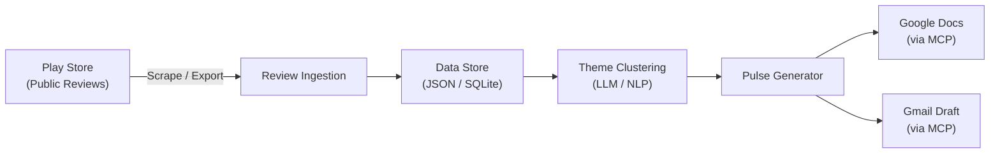
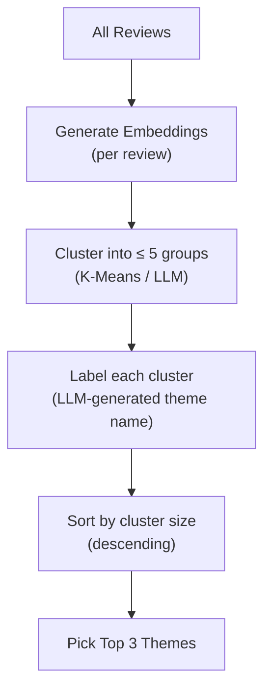
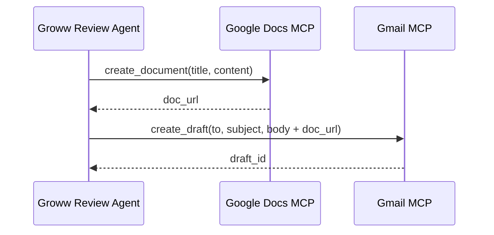
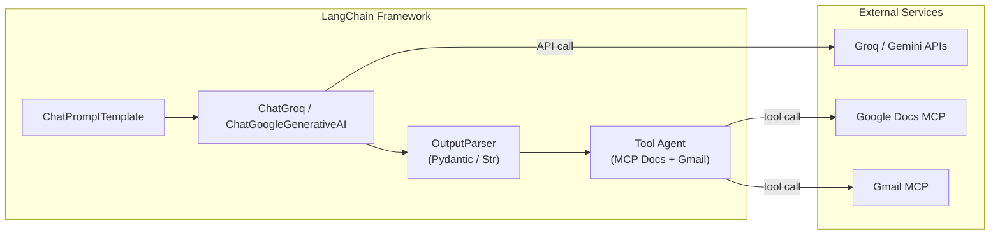
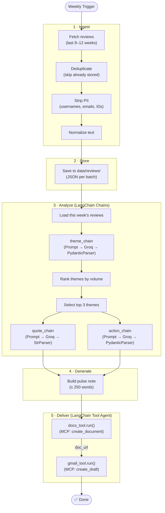
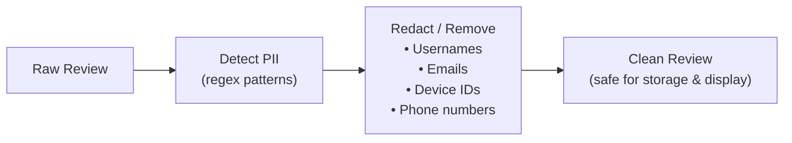

# Groww Review Agent — Architecture

## 1. System Overview

The Groww Review Agent is a **Python-based AI agent built with LangChain** that runs weekly (or on-demand) to:

1. **Ingest** public Play Store reviews for the Groww app.
2. **Analyze** reviews — clean, cluster into themes, select representative quotes.
3. **Generate** a ≤ 250-word Weekly Pulse note.
4. **Publish** the pulse to Google Docs and draft a Gmail notification — both via MCP servers.

**LangChain** serves as the orchestration backbone, providing LLM abstraction, chain composition (LCEL), structured output parsing, prompt management, and tool-calling agents that tie together every layer of the pipeline.



---

## 2. High-Level Architecture

```mermaid
graph TB
    subgraph Orchestration ["LangChain Agent Orchestrator"]
        AGENT["LangChain Agent\n(LCEL Pipeline)"]
    end

    subgraph Ingestion ["1 · Ingestion Layer"]
        RS[Review Scraper<br/>google-play-scraper]
        PP[PII Stripper &<br/>Preprocessor]
        RS --> PP
    end

    subgraph Storage ["2 · Storage Layer"]
        DS[(Local Data Store<br/>JSON / SQLite)]
    end

    subgraph Analysis ["3 · Analysis Layer (LangChain Chains)"]
        TC[Theme Clusterer<br/>ChatGroq (openai/gpt-oss-120b) +<br/>StructuredOutputParser]
        QS[Quote Selector<br/>LLMChain]
        AI[Action Idea Generator<br/>LLMChain]
        TC --> QS
        TC --> AI
    end

    subgraph Generation ["4 · Generation Layer"]
        PG[Pulse Note Builder<br/>PromptTemplate + Gemini LLM (gemini-3.6-flash)]
    end

    subgraph Delivery ["5 · Delivery Layer (LangChain Tools)"]
        MCP_DOCS[Google Docs MCP Tool]
        MCP_GMAIL[Gmail MCP Tool]
    end

    AGENT --> RS
    PP --> DS
    DS --> TC
    QS --> PG
    AI --> PG
    PG --> MCP_DOCS
    PG --> MCP_GMAIL
    AGENT -.->|orchestrates| TC
    AGENT -.->|orchestrates| PG
    AGENT -.->|calls tools| MCP_DOCS
    AGENT -.->|calls tools| MCP_GMAIL
```

---

## 3. Component Breakdown

### 3.1 Ingestion Layer

| Component | Responsibility | Technology |
|---|---|---|
| **Review Scraper** | Fetch public Play Store reviews for `com.nextbillion.groww` from the last 8–12 weeks. | [`google-play-scraper`](https://pypi.org/project/google-play-scraper/) (Python) |
| **PII Stripper** | Remove usernames, emails, device IDs, and any identifiable reviewer data before storage. | Regex patterns + validation |
| **Preprocessor** | Normalize text (lowercase, strip emojis optionally, handle multilingual reviews), deduplicate, and structure into a canonical schema. | Python (built-in) |

> [!NOTE]
> `google-play-scraper` uses publicly available Play Store data — no login or API key required. This satisfies the "public review exports only" constraint.

### 3.2 Storage Layer

| Component | Responsibility | Technology |
|---|---|---|
| **Local Data Store** | Persist raw and processed reviews with metadata (rating, date, text, theme). Support incremental ingestion (skip already-fetched reviews). | **JSON files** (MVP) or **SQLite** (scale-up) |

**Schema** (per review):

```json
{
  "review_id": "string",
  "rating": 1-5,
  "text": "string",
  "date": "ISO-8601",
  "app_version": "string | null",
  "language": "string",
  "theme": "string | null",
  "ingested_at": "ISO-8601"
}
```

### 3.3 Analysis Layer (LangChain Chains)

Each analysis component is implemented as a **LangChain chain** using LCEL (LangChain Expression Language), enabling composable, testable, and swappable LLM calls.

| Component | Responsibility | LangChain Pattern |
|---|---|---|
| **Theme Clusterer** | Group all reviews into **≤ 5 themes**. Assign each review a theme label. | `ChatPromptTemplate` → `ChatGroq` → `PydanticOutputParser` |
| **Quote Selector** | From each of the top 3 themes, pick **1 verbatim quote** that best represents the sentiment. Strip any remaining PII. | `ChatPromptTemplate` → `ChatGroq` → `StrOutputParser` |
| **Action Idea Generator** | Produce **3 concrete, actionable next-steps** grounded in the top themes. | `ChatPromptTemplate` → `ChatGroq` → `PydanticOutputParser` |

**LangChain Chain Example — Theme Clustering:**

```python
from langchain_groq import ChatGroq
from langchain_core.prompts import ChatPromptTemplate
from langchain_core.output_parsers import PydanticOutputParser
from pydantic import BaseModel, Field

# --- Structured Output Schema ---
class ThemeAssignment(BaseModel):
    theme_name: str = Field(description="Short theme label, e.g. 'KYC Issues'")
    review_ids: list[str] = Field(description="IDs of reviews in this cluster")
    count: int = Field(description="Number of reviews in this theme")

class ClusteringResult(BaseModel):
    themes: list[ThemeAssignment] = Field(max_length=5)

# --- Chain Definition (LCEL) ---
parser = PydanticOutputParser(pydantic_object=ClusteringResult)

prompt = ChatPromptTemplate.from_messages([
    ("system", "You are a product analyst. Cluster the following app reviews "
               "into at most 5 themes. {format_instructions}"),
    ("human", "{reviews}")
]).partial(format_instructions=parser.get_format_instructions())

llm = ChatGroq(model="openai/gpt-oss-120b", temperature=0.3)

theme_chain = prompt | llm | parser  # LCEL composition
```

**Theme Clustering Strategy:**



Two approaches (choose one):

| Approach | Pros | Cons |
|---|---|---|
| **LLM-only via LangChain** (ChatPromptTemplate → Gemini → OutputParser) | Simple, structured outputs via Pydantic, no embedding infra | Token cost, harder to reproduce |
| **Embeddings + K-Means** (GoogleGenerativeAIEmbeddings → scikit-learn → LLM labels) | Deterministic clustering, scalable | Requires embedding model, more code |

> [!TIP]
> **Recommended for MVP:** LLM-only approach via LangChain LCEL chains. Use `PydanticOutputParser` for type-safe structured outputs. Move to embeddings if review volume exceeds ~500/week.

### 3.4 Generation Layer

| Component | Responsibility | LangChain Pattern |
|---|---|---|
| **Pulse Note Builder** | Compile the top 3 themes, 3 quotes, and 3 action ideas into a structured ≤ 250-word document. Output both Markdown (for Docs) and plain-text (for email body). | `ChatPromptTemplate` (with Jinja2-style template) → `ChatGoogleGenerativeAI` (gemini-3.6-flash) → `StrOutputParser` |

**Pulse Template Structure:**

```
📊 Groww Weekly Review Pulse — Week of {date}

🔍 TOP THEMES
1. {theme_1} ({count_1} mentions)
2. {theme_2} ({count_2} mentions)
3. {theme_3} ({count_3} mentions)

💬 WHAT USERS ARE SAYING
• "{quote_1}" — ★{rating_1}
• "{quote_2}" — ★{rating_2}
• "{quote_3}" — ★{rating_3}

🎯 ACTION IDEAS
1. {action_1}
2. {action_2}
3. {action_3}
```

### 3.5 Delivery Layer (MCP Integration via LangChain Tools)

MCP tools are wrapped as **LangChain `Tool` objects** so the agent can call them through the standard tool-calling interface.

| Component | Responsibility | Technology |
|---|---|---|
| **Google Docs Publisher** | Create or update a Google Doc with the weekly pulse note. | Google Docs MCP Server → LangChain `Tool` wrapper |
| **Gmail Drafter** | Create a draft email containing the pulse (or a link to the Doc). | Gmail MCP Server → LangChain `Tool` wrapper |



> [!IMPORTANT]
> **MCP-First Requirement:** All Google Docs and Gmail interactions MUST go through MCP server tool calls. No direct Google API client libraries or OAuth flows in the agent code.

---

## 4. Why LangChain?

LangChain is the orchestration framework that ties together the LLM calls, structured parsing, prompt management, and tool execution. Here's how each LangChain capability maps to a project need:

| Project Need | LangChain Capability | Benefit |
|---|---|---|
| Call LLMs for clustering, quotes, actions | `ChatGroq` and `ChatGoogleGenerativeAI` | Swap models without changing pipeline code |
| Parse LLM output into typed Python objects | `PydanticOutputParser` / `JsonOutputParser` | Type-safe structured outputs, no manual JSON parsing |
| Compose multi-step analysis pipeline | **LCEL** (LangChain Expression Language) | `prompt \| llm \| parser` — readable, testable chains |
| Manage complex prompts with variables | `ChatPromptTemplate` | Reusable, version-controlled prompt templates |
| Call MCP tools (Docs, Gmail) from agent | `Tool` wrappers + `AgentExecutor` | Agent autonomously decides when to publish/draft |
| Retry on LLM failures | Built-in `.with_retry()` | Exponential backoff without custom code |
| Stream intermediate results | LCEL `.stream()` / `.astream()` | Real-time feedback during long analysis runs |
| Trace and debug LLM calls | LangSmith integration | Full observability of every chain invocation |



> [!NOTE]
> LangChain's integration packages (`langchain-groq` and `langchain-google-genai`) provide first-class support for both platforms. We use Groq for high-throughput batch processing of reviews (Phase 3) and Gemini for high-quality final pulse generation (Phase 4).

---

## 5. Tech Stack

| Layer | Technology | Purpose |
|---|---|---|
| **Language** | Python 3.11+ | Core pipeline |
| **Agent Framework** | LangChain (`langchain`, `langchain-core`, `langchain-google-genai`, `langchain-groq`) | Chain orchestration, prompt templates, output parsing, tool agents |
| **LLMs** | Groq (`openai/gpt-oss-120b`) & Gemini (`gemini-3.6-flash`) | Theme clustering, quote selection, action generation (Groq); pulse writing (Gemini) |
| **Review Fetching** | `google-play-scraper` | Public Play Store review extraction |
| **Data Storage** | JSON files (MVP) / SQLite (scale) | Persist reviews and pulse history |
| **Structured Output** | Pydantic v2 + LangChain `PydanticOutputParser` | Type-safe LLM response parsing |
| **MCP Client** | MCP SDK (`mcp` Python package) | Connect to Google Docs & Gmail MCP servers |
| **MCP ↔ LangChain** | Custom `Tool` wrappers | Expose MCP tools to LangChain agent |
| **MCP Servers** | `@anthropic/gdocs-mcp`, `@anthropic/gmail-mcp` (or equivalent) | Google Docs & Gmail tool exposure |
| **Observability** | LangSmith (optional) | Trace, debug, and monitor chain executions |
| **Scheduling** | Cron / Task Scheduler / Manual | Weekly trigger |
| **Config** | `.env` + `config.yaml` | API keys, email alias, MCP server URIs |

---

## 6. Proposed Directory Structure

```
Groww Review Agent/
├── Docs/
│   ├── ProblemStatement.txt          # Original problem statement
│   ├── problemStatement.md           # Formatted problem statement
│   └── architecture.md               # This document
├── src/
│   ├── __init__.py
│   ├── main.py                       # Pipeline orchestrator (entry point)
│   ├── config.py                     # Configuration loader
│   ├── models.py                     # Pydantic models (ThemeAssignment, PulseNote, etc.)
│   ├── ingestion/
│   │   ├── __init__.py
│   │   ├── scraper.py                # Play Store review fetcher
│   │   └── preprocessor.py           # PII stripping, normalization
│   ├── storage/
│   │   ├── __init__.py
│   │   └── store.py                  # JSON/SQLite read-write operations
│   ├── analysis/
│   │   ├── __init__.py
│   │   ├── chains.py                 # LangChain LCEL chains (cluster, quotes, actions)
│   │   ├── prompts.py                # ChatPromptTemplate definitions
│   │   └── parsers.py                # PydanticOutputParser / JsonOutputParser configs
│   ├── generation/
│   │   ├── __init__.py
│   │   └── pulse_builder.py          # Pulse note assembly (LangChain chain)
│   ├── delivery/
│   │   ├── __init__.py
│   │   ├── mcp_tools.py              # LangChain Tool wrappers for MCP servers
│   │   ├── docs_publisher.py         # Google Docs via MCP Tool
│   │   └── gmail_drafter.py          # Gmail draft via MCP Tool
│   └── agent.py                      # LangChain AgentExecutor (orchestrates full pipeline)
├── data/
│   ├── reviews/                      # Raw + processed review JSON files
│   └── pulses/                       # Generated pulse archive
├── templates/
│   └── pulse_template.md             # Prompt template for pulse generation
├── config/
│   ├── config.yaml                   # App configuration
│   └── mcp_servers.json              # MCP server connection config
├── tests/
│   ├── test_scraper.py
│   ├── test_preprocessor.py
│   ├── test_chains.py                # Test LangChain chains with mock LLM
│   ├── test_pulse_builder.py
│   └── test_agent.py                 # Integration test for full agent flow
├── .env.example                      # Environment variable template
├── requirements.txt                  # Python dependencies
├── README.md                         # Project overview + setup guide
└── .gitignore
```

---

## 7. Data Flow (Detailed)



---

## 8. MCP Integration Detail (with LangChain)

### 7.1 MCP Server Configuration

```json
{
  "mcpServers": {
    "google-docs": {
      "command": "npx",
      "args": ["-y", "@anthropic/gdocs-mcp-server"],
      "env": {
        "GOOGLE_CREDENTIALS_PATH": "./config/google-credentials.json"
      }
    },
    "gmail": {
      "command": "npx",
      "args": ["-y", "@anthropic/gmail-mcp-server"],
      "env": {
        "GOOGLE_CREDENTIALS_PATH": "./config/google-credentials.json"
      }
    }
  }
}
```

### 7.2 Tool Calls the Agent Will Use

| MCP Server | Tool | Purpose |
|---|---|---|
| **Google Docs** | `create_document` | Create a new Doc with the pulse content |
| **Google Docs** | `update_document` | Update an existing weekly pulse Doc |
| **Google Docs** | `get_document` | Read back the Doc for verification |
| **Gmail** | `create_draft` | Create a draft email with the pulse body and Doc link |

### 8.3 MCP → LangChain Tool Wrappers

MCP tools are wrapped as LangChain `Tool` objects so the agent can invoke them through the standard tool-calling interface:

```python
# src/delivery/mcp_tools.py
from langchain_core.tools import Tool
from mcp import ClientSession, StdioServerParameters
import asyncio

# --- MCP session helper ---
async def _call_mcp_tool(server_cmd: list, tool_name: str, arguments: dict) -> dict:
    """Generic helper to call any MCP server tool."""
    server_params = StdioServerParameters(command=server_cmd[0], args=server_cmd[1:])
    async with ClientSession(server_params) as session:
        return await session.call_tool(tool_name, arguments=arguments)

# --- LangChain Tool: Google Docs ---
def _publish_to_docs(input_str: str) -> str:
    """Create a Google Doc. Input: JSON with 'title' and 'content' keys."""
    import json
    args = json.loads(input_str)
    result = asyncio.run(_call_mcp_tool(
        ["npx", "-y", "@anthropic/gdocs-mcp-server"],
        "create_document", args
    ))
    return result["url"]

docs_tool = Tool(
    name="publish_google_doc",
    description="Create a Google Doc with the weekly pulse. Input: JSON {title, content}",
    func=_publish_to_docs
)

# --- LangChain Tool: Gmail Draft ---
def _draft_email(input_str: str) -> str:
    """Create a Gmail draft. Input: JSON with 'to', 'subject', 'body' keys."""
    import json
    args = json.loads(input_str)
    result = asyncio.run(_call_mcp_tool(
        ["npx", "-y", "@anthropic/gmail-mcp-server"],
        "create_draft", args
    ))
    return result["draft_id"]

gmail_tool = Tool(
    name="draft_gmail",
    description="Create a Gmail draft with the pulse note. Input: JSON {to, subject, body}",
    func=_draft_email
)
```

### 8.4 Full Agent Assembly

```python
# src/agent.py — LangChain AgentExecutor with MCP tools
from langchain_google_genai import ChatGoogleGenerativeAI
from langchain.agents import AgentExecutor, create_tool_calling_agent
from langchain_core.prompts import ChatPromptTemplate
from delivery.mcp_tools import docs_tool, gmail_tool

llm = ChatGoogleGenerativeAI(model="gemini-3.6-flash", temperature=0.3)
tools = [docs_tool, gmail_tool]

prompt = ChatPromptTemplate.from_messages([
    ("system", "You are a product analytics agent. After generating the weekly "
               "pulse, publish it to Google Docs and draft a Gmail notification."),
    ("human", "{input}"),
    ("placeholder", "{agent_scratchpad}")
])

agent = create_tool_calling_agent(llm, tools, prompt)
executor = AgentExecutor(agent=agent, tools=tools, verbose=True)

# Usage:
# result = executor.invoke({"input": pulse_content_with_instructions})
```

---

## 9. Privacy & PII Handling



**PII patterns to strip:**

| Pattern | Regex Example | Replacement |
|---|---|---|
| Email addresses | `[\w.-]+@[\w.-]+\.\w+` | `[email]` |
| Phone numbers | `\+?\d[\d\s-]{7,}` | `[phone]` |
| Usernames / mentions | `@\w+` | `[user]` |
| Device IDs / serial numbers | `[A-Z0-9]{8,}` (contextual) | `[id]` |

> [!CAUTION]
> PII stripping runs **before** any data is persisted or sent to LLMs. No raw PII should ever appear in stored reviews, pulse notes, Docs, or emails.

---

## 10. Error Handling & Resilience

| Failure Scenario | Mitigation |
|---|---|
| Play Store fetch fails (network / rate limit) | Retry with exponential backoff (3 attempts). Fall back to cached reviews if all retries fail. |
| LLM API timeout / quota exceeded | LangChain `.with_retry(stop_after_attempt=3)` on chains. If persistent, generate pulse from cached theme assignments. Log warning. |
| LangChain chain parsing failure | `OutputFixingParser` auto-retries with corrective prompt. Falls back to raw string parsing. |
| MCP server connection failure | Retry connection. Save pulse locally as fallback (`data/pulses/`). Alert via console log. |
| Zero reviews fetched | Skip pulse generation. Log info message. |
| PII detection miss | Defense-in-depth: strip at ingestion AND at pulse generation. Manual review flag for edge cases. |

---

## 11. Configuration

### `config.yaml`

```yaml
app:
  name: "Groww Review Agent"
  play_store_app_id: "com.nextbillion.groww"
  review_window_weeks: 12
  max_themes: 5
  top_themes_in_pulse: 3
  max_pulse_words: 250

email:
  to: "your-email@example.com"
  subject_prefix: "📊 Groww Weekly Pulse"

langchain:
  groq_model: "openai/gpt-oss-120b"
  gemini_model: "gemini-3.6-flash"
  temperature: 0.3
  max_retries: 3
  langsmith_tracing: false             # Set true for observability
  langsmith_project: "groww-review-agent"

storage:
  type: "json"             # "json" or "sqlite"
  reviews_dir: "data/reviews"
  pulses_dir: "data/pulses"
```

---

## 12. Execution Modes

| Mode | Command | Description |
|---|---|---|
| **Full Pipeline** | `python -m src.main` | Run complete ingest → analyze → generate → deliver |
| **Ingest Only** | `python -m src.main --step ingest` | Fetch and store new reviews |
| **Analyze Only** | `python -m src.main --step analyze` | Cluster existing reviews into themes |
| **Generate & Deliver** | `python -m src.main --step deliver` | Build pulse from latest analysis and publish |
| **Dry Run** | `python -m src.main --dry-run` | Run full pipeline but skip MCP delivery (print pulse to console) |

---

## 13. Key Dependencies (`requirements.txt`)

```
langchain>=0.3
langchain-core>=0.3
langchain-google-genai>=2.0
langchain-groq>=0.2
google-play-scraper>=1.2
pydantic>=2.0
mcp>=1.0
python-dotenv>=1.0
pyyaml>=6.0
jinja2>=3.1
```

---

## 14. Future Enhancements

| Enhancement | Description | Priority |
|---|---|---|
| **App Store (iOS) reviews** | Add Apple App Store ingestion alongside Play Store | Medium |
| **Sentiment scoring** | Add per-theme sentiment trend via LangChain chain | Medium |
| **LangGraph workflow** | Migrate from linear chains to LangGraph for stateful, conditional pipelines | Medium |
| **Historical dashboards** | Track theme trends over weeks via a simple web UI | Low |
| **Slack / Teams delivery** | Add LangChain Tool wrappers for Slack or Teams MCP servers | Low |
| **Multi-language support** | Add translation chain before clustering (Gemini multilingual) | Medium |
| **Automated scheduling** | GitHub Actions / Cloud Functions cron for fully hands-off weekly runs | High |
| **LangSmith monitoring** | Enable production tracing for cost tracking and prompt debugging | Medium |
