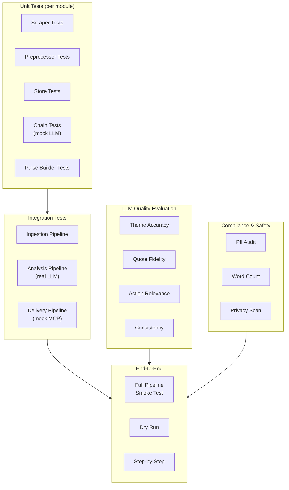
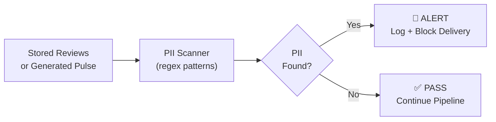

# Groww Review Agent — Evaluation Plan

This document defines the **test strategy, evaluation metrics, and validation criteria** for every component and phase of the Groww Review Agent. It covers unit tests, integration tests, LLM output quality evaluation, PII compliance audits, and end-to-end acceptance tests.

---

## 1. Evaluation Overview



### Test Pyramid

| Level | Count | Speed | Requires LLM? | Requires MCP? |
|---|---|---|---|---|
| **Unit Tests** | ~25–30 | Fast (<1s each) | No (mocked) | No |
| **Integration Tests** | ~8–10 | Medium (5–15s) | Some (real Gemini) | No (mocked) |
| **LLM Quality Evals** | ~10–12 | Slow (30–60s) | Yes (real Gemini) | No |
| **Compliance Audits** | ~5–6 | Fast (<1s) | No | No |
| **End-to-End Tests** | ~3–4 | Slow (1–2 min) | Yes | Yes (or mocked) |

---

## 2. Unit Tests

### 2.1 Scraper — `tests/test_scraper.py`

| Test Case | Input | Expected Outcome | Eval Criteria |
|---|---|---|---|
| `test_fetch_returns_list` | `app_id="com.nextbillion.groww"` | Returns a non-empty list of dicts | `isinstance(result, list)` and `len(result) > 0` |
| `test_review_schema` | Single fetched review | Contains required fields: `reviewId`, `score`, `content`, `at` | All keys present, correct types |
| `test_score_range` | Batch of reviews | All ratings between 1 and 5 | `all(1 <= r["score"] <= 5 for r in reviews)` |
| `test_date_within_window` | Reviews with 12-week window | All review dates within configured range | No review older than `now - 12 weeks` |
| `test_empty_app_id` | `app_id=""` | Raises `ValueError` or returns empty | Graceful error, no crash |
| `test_invalid_app_id` | `app_id="com.nonexistent.fake"` | Returns empty list or raises descriptive error | No unhandled exception |

### 2.2 Preprocessor — `tests/test_preprocessor.py`

| Test Case | Input | Expected Outcome | Eval Criteria |
|---|---|---|---|
| `test_strip_email` | `"Contact me at user@gmail.com"` | `"Contact me at [email]"` | No email pattern in output |
| `test_strip_phone` | `"Call +91-9876543210 now"` | `"Call [phone] now"` | No phone pattern in output |
| `test_strip_username` | `"@rahul_sharma posted this"` | `"[user] posted this"` | No `@mention` in output |
| `test_strip_device_id` | `"Device ID: ABC123DEF456"` | `"Device ID: [id]"` | No long alphanumeric ID |
| `test_multiple_pii` | Text with email + phone + username | All PII replaced | Zero PII patterns remaining |
| `test_no_false_positives` | `"I rated 5 stars in the app store"` | Text unchanged (no PII present) | Output equals input |
| `test_normalize_whitespace` | `"  too   many    spaces  "` | `"too many spaces"` | Single spaces, no leading/trailing |
| `test_empty_text_filtered` | `{"text": "", "score": 3}` | Filtered out (returns `None` or excluded) | Empty reviews removed |
| `test_unicode_handling` | `"Great app 👍🔥 बहुत अच्छा"` | Text preserved (emoji/unicode intact) | No encoding errors |
| `test_dedup_by_review_id` | Two reviews with same `reviewId` | Only one kept | `len(result) == 1` |

### 2.3 Data Store — `tests/test_store.py`

| Test Case | Input | Expected Outcome | Eval Criteria |
|---|---|---|---|
| `test_save_and_load` | List of 10 reviews | Saved to JSON, loaded back identically | `loaded == saved` |
| `test_file_naming` | Save on 2026-09-03 | File created at `data/reviews/2026-09-03.json` | File exists with correct name |
| `test_get_review_ids` | Store with 50 reviews | Returns set of 50 review IDs | `len(ids) == 50` |
| `test_load_date_range` | Reviews across 3 dates | Only reviews in range returned | All returned reviews within bounds |
| `test_save_pulse` | Pulse markdown string | Written to `data/pulses/YYYY-MM-DD.md` | File exists, content matches |
| `test_corrupted_json_handling` | Malformed JSON file | Logs warning, skips file, no crash | No `JSONDecodeError` raised |

### 2.4 LangChain Chains (Mock LLM) — `tests/test_chains.py`

| Test Case | Input | Expected Outcome | Eval Criteria |
|---|---|---|---|
| `test_theme_chain_parses` | Mock LLM returns valid JSON | `ClusteringResult` with ≤ 5 themes | Pydantic model instantiated |
| `test_theme_chain_max_5` | Mock LLM returns 7 themes | Truncated or re-prompted to ≤ 5 | `len(result.themes) <= 5` |
| `test_quote_chain_returns_3` | Mock LLM returns 3 quotes | 3 strings returned | `len(quotes) == 3` |
| `test_action_chain_returns_3` | Mock LLM returns 3 actions | 3 `ActionIdea` objects | `len(actions) == 3` |
| `test_malformed_llm_output` | Mock LLM returns invalid JSON | `OutputFixingParser` retries | No unhandled exception |
| `test_empty_reviews_input` | Empty review list | Graceful handling (skip or error) | Descriptive error, no crash |
| `test_retry_on_api_error` | Mock LLM raises `APIError` | Retries up to 3 times | Retry count verified |

### 2.5 Pulse Builder — `tests/test_pulse_builder.py`

| Test Case | Input | Expected Outcome | Eval Criteria |
|---|---|---|---|
| `test_pulse_has_all_sections` | 3 themes, 3 quotes, 3 actions | Pulse contains all sections | Regex check for each section header |
| `test_pulse_word_count` | Standard analysis output | ≤ 250 words | `len(pulse.split()) <= 250` |
| `test_pulse_markdown_format` | Standard input | Valid Markdown output | Headers, bullets, formatting present |
| `test_pulse_plain_text` | Standard input | Clean plain-text (no Markdown syntax) | No `#`, `**`, `*` in text output |
| `test_date_range_in_header` | Reviews from Jun–Sep | `"Period: Jun 23 – Sep 01, 2026"` in output | Date range present |
| `test_special_chars_escaped` | Quote with `**bold**` | Characters escaped in output | No broken Markdown |

---

## 3. LLM Quality Evaluation

> [!IMPORTANT]
> These evaluations require **real Gemini API calls** and should be run as a separate test suite. They evaluate the *quality* of LLM outputs, not just structural correctness.

### 3.1 Theme Clustering Evaluation

Run the theme chain **5 times** on the same review set and evaluate:

| Metric | How to Measure | Target | Pass Criteria |
|---|---|---|---|
| **Theme Count** | `len(result.themes)` | 3–5 themes | ≤ 5 in all 5 runs |
| **Coverage** | `sum(t.count for t in themes) / total_reviews` | ≥ 90% | No more than 10% orphaned reviews |
| **Label Quality** | Human review: are labels clear and descriptive? | Subjective | Labels like "KYC Issues" ✅, "Miscellaneous" ❌ |
| **Consistency** | Compare theme labels across 5 runs (Jaccard similarity of label sets) | ≥ 0.6 | At least 3/5 theme labels overlap across runs |
| **No Hallucinated Themes** | Every theme contains ≥ 1 real review | 100% | No empty themes |

```python
# Eval script: tests/eval_theme_clustering.py
def eval_theme_consistency(reviews, n_runs=5):
    results = [theme_chain.invoke({"reviews": reviews}) for _ in range(n_runs)]
    label_sets = [set(t.theme_name.lower() for t in r.themes) for r in results]
    
    # Jaccard similarity between consecutive runs
    similarities = []
    for i in range(len(label_sets) - 1):
        intersection = label_sets[i] & label_sets[i+1]
        union = label_sets[i] | label_sets[i+1]
        similarities.append(len(intersection) / len(union))
    
    avg_similarity = sum(similarities) / len(similarities)
    assert avg_similarity >= 0.6, f"Theme consistency too low: {avg_similarity:.2f}"
```

### 3.2 Quote Fidelity Evaluation

| Metric | How to Measure | Target | Pass Criteria |
|---|---|---|---|
| **Verbatim Match** | Fuzzy match each quote against the review corpus (`fuzz.ratio`) | ≥ 90% similarity | All 3 quotes match a real review at ≥ 90% |
| **No Invention** | Quote exists in the stored review set (exact or near-exact) | 100% | Zero fabricated quotes |
| **PII-Free** | Run PII regex on each quote | 0 PII matches | No emails, phones, names in quotes |
| **Theme Relevance** | Does the quote relate to its assigned theme? (human eval) | Subjective | Each quote clearly relates to its theme |
| **Diversity** | Quotes come from different reviews (not the same review) | 3 unique reviews | `len(set(quote_sources)) == 3` |

```python
# Eval script: tests/eval_quote_fidelity.py
from fuzzywuzzy import fuzz

def eval_quote_verbatim(quotes, review_corpus):
    for quote in quotes:
        best_match = max(review_corpus, key=lambda r: fuzz.ratio(quote, r["text"]))
        score = fuzz.ratio(quote, best_match["text"])
        assert score >= 90, f"Quote not verbatim (score={score}): {quote[:50]}..."
```

### 3.3 Action Idea Evaluation

| Metric | How to Measure | Target | Pass Criteria |
|---|---|---|---|
| **Specificity** | Human eval: is the action concrete and implementable? | Subjective | "Add KYC tracking" ✅, "Improve the app" ❌ |
| **Grounded in Themes** | Does each action connect to one of the top 3 themes? | 100% | All 3 actions traceable to a theme |
| **Uniqueness** | No duplicate or overlapping actions | 3 distinct | Semantic similarity between actions < 0.5 |
| **Feasibility** | Human eval: can a product team reasonably act on this? | Subjective | No unrealistic suggestions ("rebuild entire app") |
| **Count** | Exactly 3 actions returned | 3 | `len(actions) == 3` |

### 3.4 LLM Evaluation Rubric (Human Scoring)

For manual evaluation of pulse quality, use this 1–5 rubric:

| Score | Theme Quality | Quote Quality | Action Quality |
|---|---|---|---|
| **5** | Themes perfectly capture review sentiment; clear labels; proportional counts | All quotes verbatim, representative, PII-free, emotionally resonant | Specific, implementable, grounded in themes, would impress a PM |
| **4** | Themes are good; minor overlap between 2 themes | Quotes are real but one is less representative | Actions are good; one is slightly generic |
| **3** | Themes are acceptable; one is vague or catch-all ("Other") | Quotes are real but may be slightly modified or too short | Actions are reasonable but not highly specific |
| **2** | Themes miss major sentiment; poor labels | One quote appears invented or heavily paraphrased | Actions are generic ("improve UX") |
| **1** | Themes are wrong or nonsensical; clustering failed | Multiple fabricated quotes; PII present | Actions are irrelevant or infeasible |

> [!TIP]
> Run the rubric evaluation on **3 different review batches** (positive-heavy, negative-heavy, mixed) and average the scores. Target: **≥ 4.0 average** across all dimensions.

---

## 4. PII Compliance Evaluation

### 4.1 PII Detection Test Suite

```python
# tests/eval_pii_compliance.py

PII_TEST_CASES = [
    # (input_text, should_be_redacted, pii_type)
    ("Email me at user@gmail.com", True, "email"),
    ("Call +91-9876543210", True, "phone"),
    ("Call 91 98765 43210", True, "phone"),
    ("@rahul_sharma said this", True, "username"),
    ("Device: ABCD1234EFGH", True, "device_id"),
    ("UPI: user@oksbi", True, "upi_id"),
    ("my number is nine eight seven six", True, "obfuscated_phone"),
    
    # False positive checks (should NOT be redacted)
    ("I rated 5 stars", False, "none"),
    ("Version 12.3.45 is broken", False, "none"),
    ("KYC pending since 2026", False, "none"),
    ("Transaction #12345", False, "none"),
    ("App crashes at 10 AM", False, "none"),
]
```

### 4.2 PII Audit Pipeline

Run this audit **after every ingestion and before every delivery**:



| Audit Point | When | What's Scanned | Action on Fail |
|---|---|---|---|
| **Post-Ingestion** | After `save_reviews()` | All stored review JSON files | Log warning, re-run PII stripper |
| **Post-Clustering** | After `theme_chain` | Theme labels and review text passed to LLM | Should already be clean — flag if not |
| **Post-Quote-Selection** | After `quote_chain` | Each selected quote | Block quote, select alternative |
| **Pre-Delivery** | Before Docs/Gmail publish | Final pulse note (Markdown + text) | Block delivery, save locally, alert |

### 4.3 PII Compliance Metrics

| Metric | Target | Measurement |
|---|---|---|
| **PII Detection Rate** | ≥ 95% of known PII patterns | Test against PII_TEST_CASES |
| **False Positive Rate** | ≤ 5% | Legitimate text incorrectly flagged |
| **Zero PII in Outputs** | 100% clean | Scan all pulses, Docs, and drafts |
| **Audit Pass Rate** | 100% across all audit points | Automated pipeline check |

---

## 5. Pulse Quality Evaluation

### 5.1 Structural Validation

| Check | Expected | How to Validate | Auto/Manual |
|---|---|---|---|
| Contains "TOP THEMES" section | Yes | Regex: `r"TOP THEMES"` | Auto |
| Contains exactly 3 themes | Yes | Count lines matching `r"^\d\.\s"` in themes section | Auto |
| Each theme has mention count | Yes | Regex: `r"\(\d+ mentions\)"` | Auto |
| Contains "WHAT USERS ARE SAYING" | Yes | Regex: `r"WHAT USERS ARE SAYING"` | Auto |
| Contains exactly 3 quotes | Yes | Count lines matching `r"^•\s\""` | Auto |
| Each quote has star rating | Yes | Regex: `r"★[1-5]"` | Auto |
| Contains "ACTION IDEAS" section | Yes | Regex: `r"ACTION IDEAS"` | Auto |
| Contains exactly 3 actions | Yes | Count lines matching `r"^\d\.\s"` in actions section | Auto |
| Contains date range / period | Yes | Regex: `r"Period:|Week of"` | Auto |
| Contains review count | Yes | Regex: `r"Reviews analyzed:\s*\d+"` | Auto |

### 5.2 Content Quality Validation

| Check | Target | How to Validate | Auto/Manual |
|---|---|---|---|
| **Word count** | ≤ 250 | `len(pulse.split())` | Auto |
| **Readability** | Flesch-Kincaid grade ≤ 10 | `textstat.flesch_kincaid_grade(pulse)` | Auto |
| **No jargon/filler** | No "in conclusion," "it is worth noting" | Blocklist regex check | Auto |
| **Quotes are verbatim** | Match stored reviews at ≥ 90% fuzzy | `fuzz.ratio` | Auto |
| **Themes match reviews** | Theme labels reflect actual review content | Human review | Manual |
| **Actions are actionable** | Specific product improvements | Human review | Manual |
| **No hallucinated data** | Mention counts match actual cluster sizes | Compare against `ClusteringResult.count` | Auto |

### 5.3 Automated Pulse Scoring

```python
# tests/eval_pulse_quality.py

def score_pulse(pulse_text: str, analysis_result: dict) -> dict:
    """Automated quality scoring for a generated pulse."""
    scores = {}
    
    # 1. Word count (0-100)
    word_count = len(pulse_text.split())
    scores["word_count"] = 100 if word_count <= 250 else max(0, 100 - (word_count - 250) * 2)
    
    # 2. Structural completeness (0-100)
    required = ["TOP THEMES", "WHAT USERS ARE SAYING", "ACTION IDEAS"]
    found = sum(1 for r in required if r in pulse_text)
    scores["structure"] = int(found / len(required) * 100)
    
    # 3. Theme count (0-100)
    import re
    themes = re.findall(r"^\d\.\s.+\(\d+ mentions\)", pulse_text, re.MULTILINE)
    scores["theme_count"] = 100 if len(themes) == 3 else 50 if len(themes) >= 1 else 0
    
    # 4. Quote count (0-100)
    quotes = re.findall(r'^•\s"', pulse_text, re.MULTILINE)
    scores["quote_count"] = 100 if len(quotes) == 3 else 50 if len(quotes) >= 1 else 0
    
    # 5. Action count (0-100)
    actions_section = pulse_text.split("ACTION IDEAS")[-1] if "ACTION IDEAS" in pulse_text else ""
    actions = re.findall(r"^\d\.\s", actions_section, re.MULTILINE)
    scores["action_count"] = 100 if len(actions) == 3 else 50 if len(actions) >= 1 else 0
    
    # 6. PII check (0 or 100)
    pii_patterns = [r"[\w.-]+@[\w.-]+\.\w+", r"\+?\d[\d\s-]{7,}", r"@\w+"]
    pii_found = any(re.search(p, pulse_text) for p in pii_patterns)
    scores["pii_free"] = 0 if pii_found else 100
    
    # Overall
    scores["overall"] = sum(scores.values()) // len(scores)
    return scores
```

---

## 6. Integration Tests

### 6.1 Ingestion Pipeline — `tests/test_integration_ingest.py`

| Test Case | Description | Pass Criteria |
|---|---|---|
| `test_full_ingest_pipeline` | Fetch → Preprocess → Store (real Play Store) | Reviews saved to `data/reviews/`, ≥ 50 reviews, no PII |
| `test_ingest_idempotent` | Run ingestion twice | Second run adds 0 new reviews (all deduped) |
| `test_ingest_with_pii_audit` | Ingest + scan stored files for PII | 0 PII patterns found in stored JSON |

### 6.2 Analysis Pipeline — `tests/test_integration_analysis.py`

| Test Case | Description | Pass Criteria |
|---|---|---|
| `test_full_analysis_pipeline` | Load real reviews → theme_chain → quote_chain → action_chain | All 3 chains produce valid outputs |
| `test_analysis_on_small_batch` | Run analysis on 15 reviews | Produces ≤ 5 themes, 3 quotes, 3 actions |
| `test_analysis_on_large_batch` | Run analysis on 500 reviews | Completes without token errors |
| `test_analysis_determinism` | Run 3 times on same input | ≥ 60% theme label overlap |

### 6.3 Delivery Pipeline — `tests/test_integration_delivery.py`

| Test Case | Description | Pass Criteria |
|---|---|---|
| `test_docs_publish_mock` | Publish pulse to mocked Docs MCP | Returns `doc_url` string |
| `test_gmail_draft_mock` | Create draft with mocked Gmail MCP | Returns `draft_id` string |
| `test_delivery_fallback` | MCP server unavailable | Pulse saved locally, no crash |
| `test_agent_executor_flow` | AgentExecutor with both mock tools | Calls both tools, returns results |

---

## 7. End-to-End Acceptance Tests

### 7.1 Full Pipeline Smoke Test

```bash
# Run the complete pipeline
python -m src.main

# Expected: 
# ✅ Fetched {N} reviews
# ✅ Preprocessed and stored
# ✅ Clustered into {N} themes
# ✅ Selected 3 quotes
# ✅ Generated 3 action ideas
# ✅ Pulse generated (XXX words)
# ✅ Published to Google Docs: {url}
# ✅ Gmail draft created: {draft_id}
```

| Check | How | Pass Criteria |
|---|---|---|
| Pipeline completes | Exit code 0 | No unhandled exceptions |
| Google Doc exists | Open `doc_url` in browser | Content matches generated pulse |
| Gmail draft exists | Open Gmail → Drafts | Draft with correct subject and body |
| Pulse quality | Run `score_pulse()` | Overall score ≥ 80 |
| PII compliance | Run PII audit on Doc + draft | Zero PII |
| Word count | Count words in Doc | ≤ 250 |

### 7.2 Dry Run Test

```bash
python -m src.main --dry-run
```

| Check | Pass Criteria |
|---|---|
| Pulse printed to console | Full pulse text visible in stdout |
| No Google Doc created | No new Docs in Google account |
| No Gmail draft created | No new drafts in Gmail |
| Pulse saved locally | File exists at `data/pulses/YYYY-MM-DD.md` |

### 7.3 Step-by-Step Tests

| Command | Expected Result |
|---|---|
| `python -m src.main --step ingest` | Reviews fetched and stored. No analysis or delivery. |
| `python -m src.main --step analyze` | Analysis runs on stored reviews. No ingestion or delivery. |
| `python -m src.main --step deliver` | Publishes latest saved pulse. No ingestion or analysis. |

---

## 8. Performance Benchmarks

| Metric | Target | How to Measure | Acceptable Range |
|---|---|---|---|
| **Ingestion time** (500 reviews) | < 30s | `time python -m src.main --step ingest` | 10–60s |
| **Theme clustering** (100 reviews) | < 15s | Timer around `theme_chain.invoke()` | 5–30s |
| **Quote selection** | < 10s | Timer around `quote_chain.invoke()` | 3–20s |
| **Action generation** | < 10s | Timer around `action_chain.invoke()` | 3–20s |
| **Pulse generation** | < 10s | Timer around `build_pulse()` | 3–20s |
| **Docs publish** | < 5s | Timer around `docs_tool.run()` | 2–10s |
| **Gmail draft** | < 5s | Timer around `gmail_tool.run()` | 2–10s |
| **Full pipeline** | < 2 min | `time python -m src.main` | 1–5 min |
| **Memory usage** | < 500 MB | `tracemalloc` or `memory_profiler` | 100–500 MB |

---

## 9. Regression Test Strategy

### When to Run Which Tests

| Trigger | Unit | Integration | LLM Quality | E2E |
|---|---|---|---|---|
| Every code change | ✅ | ❌ | ❌ | ❌ |
| PR / merge to main | ✅ | ✅ | ❌ | ❌ |
| Prompt template change | ✅ | ✅ | ✅ | ❌ |
| LLM model upgrade | ✅ | ✅ | ✅ | ✅ |
| MCP server change | ✅ | ❌ | ❌ | ✅ |
| Weekly production run | ❌ | ❌ | ❌ | ✅ |

### Test Commands

```bash
# Unit tests only (fast, no API calls)
pytest tests/test_scraper.py tests/test_preprocessor.py tests/test_store.py tests/test_chains.py tests/test_pulse_builder.py -v

# Integration tests (requires Gemini API key)
pytest tests/test_integration_*.py -v --timeout=120

# LLM quality evaluation (slow, real API calls)
pytest tests/eval_*.py -v --timeout=300

# Full suite
pytest tests/ -v --timeout=300

# With coverage
pytest tests/ --cov=src --cov-report=html
```

---

## 10. Evaluation Scorecard

Use this scorecard to assess overall project readiness at the end of each phase:

| Category | Weight | Phase 1 | Phase 2 | Phase 3 | Phase 4 | Phase 5 |
|---|---|---|---|---|---|---|
| **Unit Tests Pass** | 20% | ⬜ | ⬜ | ⬜ | ⬜ | ⬜ |
| **Integration Tests Pass** | 15% | — | ⬜ | ⬜ | ⬜ | ⬜ |
| **PII Compliance** | 20% | — | ⬜ | ⬜ | ⬜ | ⬜ |
| **LLM Quality Score (≥4/5)** | 15% | — | — | ⬜ | ⬜ | ⬜ |
| **Pulse Quality Score (≥80)** | 10% | — | — | — | ⬜ | ⬜ |
| **E2E Pipeline Works** | 15% | — | — | — | — | ⬜ |
| **Performance in Bounds** | 5% | — | — | — | — | ⬜ |
| **Overall Readiness** | **100%** | ⬜ | ⬜ | ⬜ | ⬜ | ⬜ |

> **Scoring:** ⬜ = Not evaluated, ✅ = Pass, ❌ = Fail, ⚠️ = Partial pass

### Phase Gate Criteria

| Phase | Gate | Must Pass Before Proceeding |
|---|---|---|
| **Phase 1 → 2** | Setup verified | Gemini API responds, config loads, models instantiate |
| **Phase 2 → 3** | Ingestion works | ≥ 200 reviews stored, PII audit passes |
| **Phase 3 → 4** | Analysis quality | Theme consistency ≥ 0.6, quote fidelity ≥ 90%, LLM quality ≥ 4/5 |
| **Phase 4 → 5** | Pulse complete | Pulse score ≥ 80, word count ≤ 250, dry-run works |
| **Phase 5 → Done** | Full pipeline | E2E smoke test passes, Doc + Draft created, PII audit clean |

---

## 11. Test Data Strategy

| Data Set | Purpose | Source | Size |
|---|---|---|---|
| **Live reviews** | Integration + E2E tests | Real Play Store scrape | 200–500 reviews |
| **Golden set** | LLM quality baseline | Hand-curated 50 reviews with known themes | 50 reviews |
| **PII-heavy set** | PII stripper stress test | Synthetic reviews with injected PII | 30 reviews |
| **Edge case set** | Boundary testing | Single-word reviews, emoji-only, 5000-char reviews, non-English | 20 reviews |
| **Mock LLM responses** | Unit tests (no API calls) | Pre-recorded JSON responses | 10 fixtures |

```
tests/
├── fixtures/
│   ├── golden_reviews.json           # 50 curated reviews with expected themes
│   ├── pii_test_reviews.json         # Reviews with known PII for stripper testing
│   ├── edge_case_reviews.json        # Boundary/extreme reviews
│   ├── mock_clustering_response.json # Pre-recorded LLM output
│   ├── mock_quotes_response.json
│   └── mock_actions_response.json
├── eval_theme_clustering.py
├── eval_quote_fidelity.py
├── eval_pii_compliance.py
├── eval_pulse_quality.py
├── test_scraper.py
├── test_preprocessor.py
├── test_store.py
├── test_chains.py
├── test_pulse_builder.py
├── test_agent.py
├── test_integration_ingest.py
├── test_integration_analysis.py
└── test_integration_delivery.py
```
