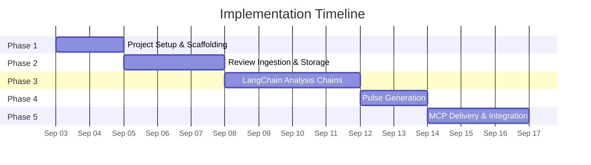
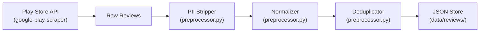
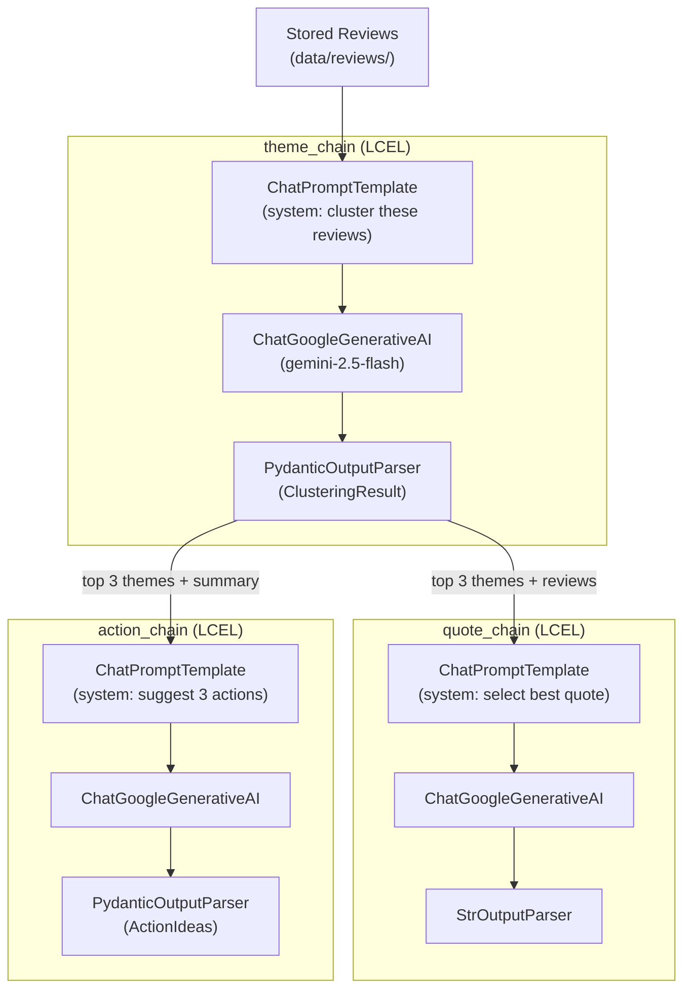
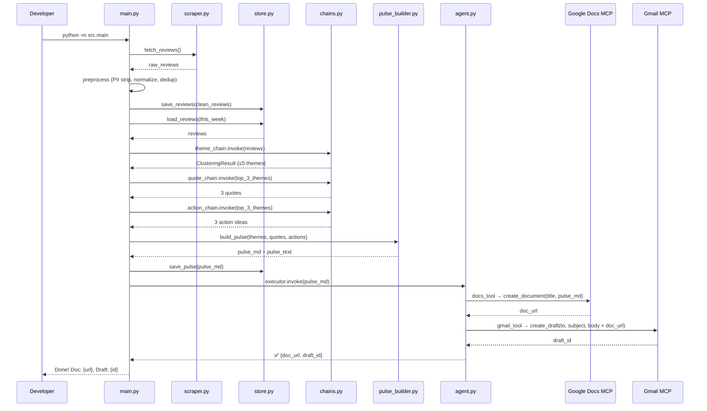
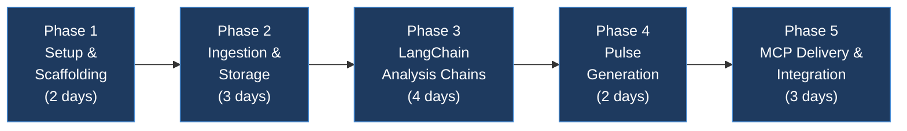

# Groww Review Agent — Phase-Wise Implementation Plan

## Overview

This document breaks the Groww Review Agent into **5 implementation phases**, each producing a working, testable increment. Every phase has clear goals, files to create/modify, acceptance criteria, and estimated effort.



---

## Phase 1 — Project Setup & Scaffolding

> **Goal:** Establish the project structure, install all dependencies, configure environment, and validate that LangChain + Gemini connectivity works.

### Duration: ~2 days

### Tasks

| # | Task | Files | Details |
|---|---|---|---|
| 1.1 | Create directory structure | All directories under `src/`, `data/`, `config/`, `tests/`, `templates/` | Follow the layout from [architecture.md](file:///d:/Groww%20Review%20Agent/Docs/architecture.md) §6 |
| 1.2 | Initialize Python project | `requirements.txt`, `.env.example`, `.gitignore` | Pin all dependencies from architecture §13 |
| 1.3 | Create configuration loader | `src/config.py`, `config/config.yaml` | Load YAML config + `.env` environment variables using `pyyaml` + `python-dotenv` |
| 1.4 | Define Pydantic data models | `src/models.py` | `Review`, `ThemeAssignment`, `ClusteringResult`, `PulseNote`, `ActionIdea` |
| 1.5 | Validate LangChain + Gemini | `tests/test_llm_connection.py` | Simple "hello world" chain: `ChatPromptTemplate` → `ChatGoogleGenerativeAI` → `StrOutputParser` |
| 1.6 | Set up `main.py` entry point | `src/main.py` | CLI arg parser (`--step`, `--dry-run`), placeholder calls for each pipeline stage |
| 1.7 | Initialize Git repo | `.git`, `README.md` | Initial commit with project skeleton |

### Files Created

```
src/__init__.py
src/main.py
src/config.py
src/models.py
src/ingestion/__init__.py
src/storage/__init__.py
src/analysis/__init__.py
src/generation/__init__.py
src/delivery/__init__.py
config/config.yaml
.env.example
.gitignore
requirements.txt
README.md
tests/test_llm_connection.py
```

### Acceptance Criteria

- [ ] `pip install -r requirements.txt` succeeds without errors
- [ ] `python -m src.main --help` prints available CLI options
- [ ] `pytest tests/test_llm_connection.py` passes — confirms Gemini API key works and LangChain returns a response
- [ ] `config.yaml` loads correctly via `src/config.py`
- [ ] All Pydantic models in `src/models.py` can be instantiated with sample data

### Key Decisions

> [!IMPORTANT]
> **Gemini API Key:** Must be set in `.env` as `GOOGLE_API_KEY`. Verify with the team which key to use (personal vs. shared project key).

---

## Phase 2 — Review Ingestion & Storage

> **Goal:** Fetch real Groww Play Store reviews, strip PII, normalize, deduplicate, and persist them locally in JSON format.

### Duration: ~3 days

### Dependencies: Phase 1 complete

### Tasks

| # | Task | Files | Details |
|---|---|---|---|
| 2.1 | Build Play Store scraper | `src/ingestion/scraper.py` | Use `google-play-scraper` to fetch reviews for `com.nextbillion.groww`. Parameters: `count=500+`, `sort=Sort.NEWEST`, last 8–12 weeks. Return list of raw review dicts. |
| 2.2 | Build PII stripper | `src/ingestion/preprocessor.py` | Regex-based PII detection and redaction (emails → `[email]`, phones → `[phone]`, usernames → `[user]`, device IDs → `[id]`). Must run **before** any persistence. |
| 2.3 | Build text normalizer | `src/ingestion/preprocessor.py` | Lowercase, strip excessive whitespace, handle unicode/emoji, truncate extremely long reviews. |
| 2.4 | Build deduplication logic | `src/ingestion/preprocessor.py` | Deduplicate by `review_id`. Skip reviews already present in the data store. |
| 2.5 | Build JSON data store | `src/storage/store.py` | `save_reviews(reviews)`, `load_reviews(date_range)`, `get_review_ids()`. Store as `data/reviews/YYYY-MM-DD.json` per batch. |
| 2.6 | Wire ingestion into `main.py` | `src/main.py` | `--step ingest` triggers: scrape → preprocess → store |
| 2.7 | Write unit tests | `tests/test_scraper.py`, `tests/test_preprocessor.py` | Test PII stripping with known inputs, test dedup logic, test scraper returns expected schema |

### Files Created/Modified

```
[NEW]  src/ingestion/scraper.py
[NEW]  src/ingestion/preprocessor.py
[NEW]  src/storage/store.py
[MOD]  src/main.py
[NEW]  tests/test_scraper.py
[NEW]  tests/test_preprocessor.py
[NEW]  data/reviews/           (created at runtime)
```

### Data Flow (Phase 2)



### Acceptance Criteria

- [ ] `python -m src.main --step ingest` fetches and stores reviews successfully
- [ ] Reviews stored in `data/reviews/YYYY-MM-DD.json` with correct schema matching `models.Review`
- [ ] PII stripping verified: no emails, phone numbers, or usernames in stored reviews
- [ ] Running ingestion twice does not create duplicate entries
- [ ] At least 200+ reviews fetched from Groww's Play Store listing
- [ ] All unit tests pass: `pytest tests/test_scraper.py tests/test_preprocessor.py`

> [!CAUTION]
> **PII is the #1 risk.** Every stored review must pass through the PII stripper. Add a post-save validation check that scans stored JSON for PII patterns and raises an alert if any slip through.

---

## Phase 3 — LangChain Analysis Chains

> **Goal:** Build the three core LangChain LCEL chains — theme clustering, quote selection, and action idea generation — with structured outputs via Pydantic.

### Duration: ~4 days

### Dependencies: Phase 2 complete (need real reviews to test against)

### Tasks

| # | Task | Files | Details |
|---|---|---|---|
| 3.1 | Define analysis prompt templates | `src/analysis/prompts.py` | Three `ChatPromptTemplate` definitions: (a) theme clustering, (b) quote selection, (c) action ideas. Include format instructions from output parsers. |
| 3.2 | Configure output parsers | `src/analysis/parsers.py` | `PydanticOutputParser(pydantic_object=ClusteringResult)` for themes, `PydanticOutputParser` for actions, `StrOutputParser` for quotes. |
| 3.3 | Build theme clustering chain | `src/analysis/chains.py` | `theme_chain = prompt | llm | parser`. Input: batch of review texts. Output: `ClusteringResult` (≤ 5 themes with review IDs and counts). |
| 3.4 | Build quote selection chain | `src/analysis/chains.py` | `quote_chain = prompt | llm | parser`. Input: top 3 themes + their reviews. Output: 1 verbatim quote per theme (3 total). |
| 3.5 | Build action idea chain | `src/analysis/chains.py` | `action_chain = prompt | llm | parser`. Input: top 3 themes + summary. Output: 3 concrete action ideas. |
| 3.6 | Add retry logic | `src/analysis/chains.py` | `.with_retry(stop_after_attempt=3)` on each chain. Add `OutputFixingParser` as fallback for parsing failures. |
| 3.7 | Wire analysis into `main.py` | `src/main.py` | `--step analyze` triggers: load reviews → run theme_chain → run quote_chain → run action_chain → save results |
| 3.8 | Write chain tests | `tests/test_chains.py` | Test with real reviews (integration) + mock LLM responses (unit). Verify Pydantic models parse correctly. |

### Files Created/Modified

```
[NEW]  src/analysis/prompts.py
[NEW]  src/analysis/parsers.py
[NEW]  src/analysis/chains.py
[MOD]  src/main.py
[NEW]  tests/test_chains.py
```

### Chain Architecture (Phase 3)



### Prompt Design Guidelines

| Chain | System Prompt Key Points | Expected Output |
|---|---|---|
| **theme_chain** | "You are a product analyst. Group these mobile app reviews into at most 5 themes. Each theme needs a short label, the review IDs it contains, and a count." | `ClusteringResult` (Pydantic) |
| **quote_chain** | "From the reviews in each theme below, select the single most representative verbatim quote. Do not modify the text. Do not include any PII." | 3 plain-text quotes |
| **action_chain** | "Based on these user feedback themes, suggest 3 specific, actionable improvements the product team can implement. Be concrete, not generic." | `ActionIdeas` (Pydantic) |

### Acceptance Criteria

- [ ] `python -m src.main --step analyze` runs successfully on real ingested reviews
- [ ] Theme clustering produces ≤ 5 themes, each with a clear label
- [ ] Top 3 themes are correctly ranked by volume (descending)
- [ ] 3 verbatim quotes returned — none invented, all traceable to real reviews
- [ ] 3 action ideas returned — specific to Groww, not generic advice
- [ ] Pydantic parsing succeeds consistently (>90% of runs without `OutputFixingParser` fallback)
- [ ] Retry logic handles transient Gemini API errors gracefully
- [ ] `pytest tests/test_chains.py` passes

> [!TIP]
> **Prompt iteration is expected.** Budget time for 3–5 rounds of prompt refinement per chain. Test with diverse review batches (positive-heavy, negative-heavy, mixed).

---

## Phase 4 — Pulse Note Generation

> **Goal:** Assemble the analysis outputs (themes, quotes, actions) into a polished ≤ 250-word Weekly Pulse note in both Markdown and plain-text formats.

### Duration: ~2 days

### Dependencies: Phase 3 complete

### Tasks

| # | Task | Files | Details |
|---|---|---|---|
| 4.1 | Create pulse template | `templates/pulse_template.md` | Markdown template with placeholders for date, themes (with counts), quotes (with ratings), and action ideas |
| 4.2 | Build pulse builder chain | `src/generation/pulse_builder.py` | LangChain chain that takes structured analysis output and produces the final pulse note. Enforce ≤ 250 words via prompt instruction. Output both Markdown and plain-text variants. |
| 4.3 | Add word count validation | `src/generation/pulse_builder.py` | Post-generation check: if pulse > 250 words, re-prompt LLM to condense. Log warning if still over limit. |
| 4.4 | Add pulse archiving | `src/storage/store.py` | `save_pulse(pulse, date)` → writes to `data/pulses/YYYY-MM-DD.md`. Keep history of all generated pulses. |
| 4.5 | Wire generation into `main.py` | `src/main.py` | Full pipeline now works: ingest → analyze → generate. `--dry-run` prints pulse to console without delivery. |
| 4.6 | Write tests | `tests/test_pulse_builder.py` | Test template rendering with mock analysis data. Verify word count constraint. Verify both Markdown and plain-text outputs. |

### Files Created/Modified

```
[NEW]  templates/pulse_template.md
[NEW]  src/generation/pulse_builder.py
[MOD]  src/storage/store.py
[MOD]  src/main.py
[NEW]  tests/test_pulse_builder.py
[NEW]  data/pulses/             (created at runtime)
```

### Pulse Output Example

```
📊 Groww Weekly Review Pulse — Week of Sep 01, 2026

🔍 TOP THEMES
1. KYC Verification Issues (87 mentions)
2. Payment Failures (64 mentions)
3. App Crashes & Performance (51 mentions)

💬 WHAT USERS ARE SAYING
• "KYC has been pending for 3 weeks, no response from support" — ★1
• "Payment failed twice but amount was debited, still waiting for refund" — ★2
• "App freezes every time I try to check my portfolio" — ★1

🎯 ACTION IDEAS
1. Add KYC status tracking with estimated resolution time in the app
2. Implement automatic refund triggers for failed payment transactions
3. Profile and optimize portfolio loading — target <2s cold start

📅 Reviews analyzed: 412 | Period: Jun 23 – Sep 01, 2026
```

### Acceptance Criteria

- [ ] `python -m src.main --dry-run` prints a complete pulse to console
- [ ] Pulse contains exactly 3 themes, 3 quotes, 3 action ideas
- [ ] Pulse is ≤ 250 words
- [ ] Quotes are verbatim (match stored reviews exactly)
- [ ] Both Markdown and plain-text variants are generated
- [ ] Pulse is archived to `data/pulses/YYYY-MM-DD.md`
- [ ] `pytest tests/test_pulse_builder.py` passes

---

## Phase 5 — MCP Delivery & End-to-End Integration

> **Goal:** Publish the pulse to Google Docs and create a Gmail draft — both via MCP servers wrapped as LangChain tools. Wire the complete end-to-end pipeline.

### Duration: ~3 days

### Dependencies: Phase 4 complete + MCP servers configured

### Tasks

| # | Task | Files | Details |
|---|---|---|---|
| 5.1 | Configure MCP servers | `config/mcp_servers.json` | Set up Google Docs and Gmail MCP server connection configs per architecture §8.1 |
| 5.2 | Build MCP tool wrappers | `src/delivery/mcp_tools.py` | Wrap MCP tools as LangChain `Tool` objects: `docs_tool` and `gmail_tool` (per architecture §8.3) |
| 5.3 | Build Docs publisher | `src/delivery/docs_publisher.py` | `publish_pulse(pulse_md, title) → doc_url`. Creates a new Google Doc (or updates existing). Returns the document URL. |
| 5.4 | Build Gmail drafter | `src/delivery/gmail_drafter.py` | `draft_pulse_email(to, subject, body, doc_url) → draft_id`. Creates a Gmail draft with the pulse content and a link to the Doc. |
| 5.5 | Build LangChain agent | `src/agent.py` | `AgentExecutor` with `docs_tool` + `gmail_tool`. Receives the generated pulse and autonomously publishes + drafts. |
| 5.6 | Wire full pipeline in `main.py` | `src/main.py` | `python -m src.main` runs: ingest → analyze → generate → deliver (Docs + Gmail). `--step deliver` runs only the delivery stage. |
| 5.7 | Add delivery fallback | `src/delivery/docs_publisher.py`, `src/delivery/gmail_drafter.py` | If MCP fails: save pulse locally, log error, print instructions for manual delivery. |
| 5.8 | Write integration tests | `tests/test_agent.py` | Mock MCP server responses. Test full pipeline flow with sample data. Verify Doc URL and draft ID are returned. |
| 5.9 | End-to-end smoke test | Manual | Run full pipeline against real reviews → verify Google Doc created → verify Gmail draft exists |

### Files Created/Modified

```
[NEW]  config/mcp_servers.json
[NEW]  src/delivery/mcp_tools.py
[NEW]  src/delivery/docs_publisher.py
[NEW]  src/delivery/gmail_drafter.py
[NEW]  src/agent.py
[MOD]  src/main.py
[NEW]  tests/test_agent.py
```

### End-to-End Flow (Phase 5)



### Acceptance Criteria

- [ ] `python -m src.main` runs the complete pipeline end-to-end without errors
- [ ] A Google Doc is created with the correct pulse content and title
- [ ] A Gmail draft is created containing the pulse and a link to the Google Doc
- [ ] `--dry-run` skips MCP delivery and prints pulse to console
- [ ] `--step deliver` re-publishes the latest saved pulse without re-ingesting or re-analyzing
- [ ] MCP failures are handled gracefully — pulse is saved locally as fallback
- [ ] `pytest tests/test_agent.py` passes with mock MCP responses
- [ ] No PII present in the final Google Doc or Gmail draft

> [!WARNING]
> **MCP Server Setup Required:** Before starting Phase 5, ensure:
> 1. Google OAuth credentials are configured at `config/google-credentials.json`
> 2. MCP servers for Docs and Gmail are installed and accessible
> 3. The target email address is set in `config/config.yaml`

---

## Phase Summary



| Phase | Duration | Key Deliverable | Runnable Command |
|---|---|---|---|
| **Phase 1** | ~2 days | Project skeleton + Gemini connectivity | `pytest tests/test_llm_connection.py` |
| **Phase 2** | ~3 days | Reviews ingested and stored | `python -m src.main --step ingest` |
| **Phase 3** | ~4 days | Themes, quotes, actions from real reviews | `python -m src.main --step analyze` |
| **Phase 4** | ~2 days | Polished pulse note (≤ 250 words) | `python -m src.main --dry-run` |
| **Phase 5** | ~3 days | Full pipeline with Docs + Gmail delivery | `python -m src.main` |
| **Total** | **~14 days** | | |

---

## Risk Register

| Risk | Impact | Likelihood | Mitigation |
|---|---|---|---|
| Gemini API rate limits during batch clustering | High | Medium | Chunk reviews into batches of 50. Add `.with_retry()`. Cache results. |
| `google-play-scraper` breaks due to Play Store changes | High | Low | Pin version. Add fallback to manual CSV import. Monitor for library updates. |
| LLM produces inconsistent theme labels across runs | Medium | High | Seed with predefined theme categories in prompt. Use low temperature (0.3). |
| MCP server authentication issues | High | Medium | Test OAuth flow early in Phase 5. Document manual credential setup steps. |
| PII leaks into generated pulse | Critical | Low | Double-strip: at ingestion AND at generation. Add automated PII scan in tests. |
| Pulse exceeds 250-word limit | Low | Medium | Post-generation word count check. Re-prompt if over. Hard-truncate as last resort. |

---

## Definition of Done (Project-Level)

The project is **complete** when ALL of the following are true:

- [ ] Running `python -m src.main` successfully executes the full pipeline
- [ ] A Google Doc is created with the Weekly Pulse containing top 3 themes, 3 verbatim quotes, and 3 action ideas
- [ ] A Gmail draft is created linking to the Google Doc
- [ ] The pulse is ≤ 250 words
- [ ] No PII is present in any artifact (stored reviews, pulse, Doc, email)
- [ ] All tests pass: `pytest tests/`
- [ ] The project is documented with README.md setup instructions
- [ ] Code is committed to Git with clean history
