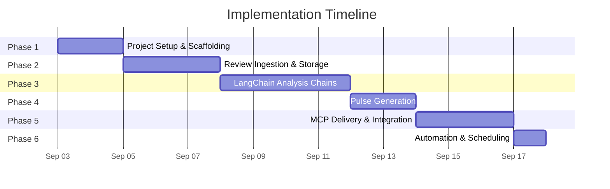
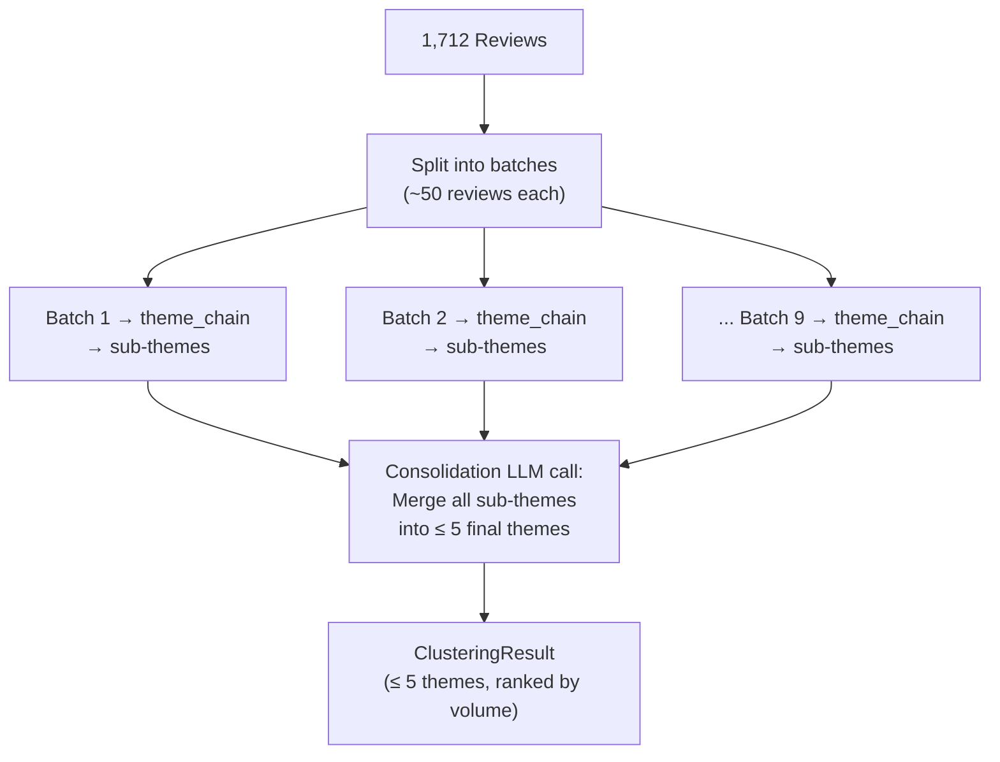
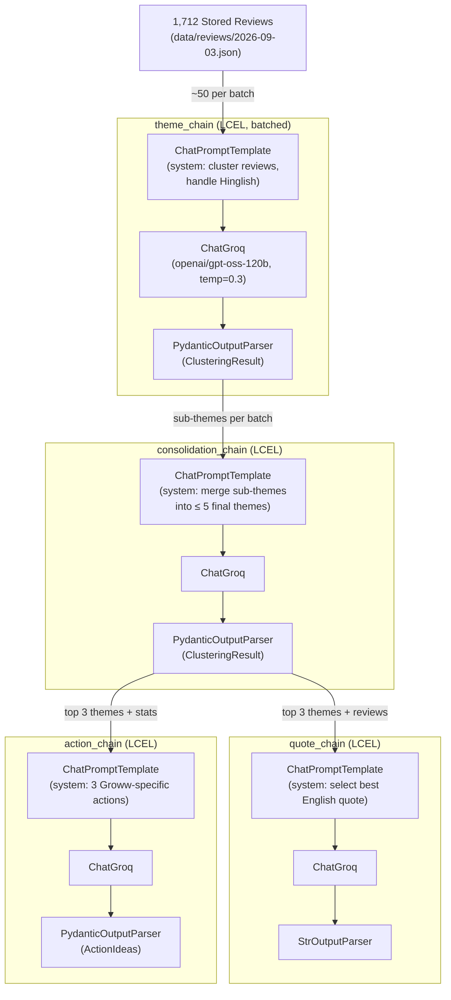
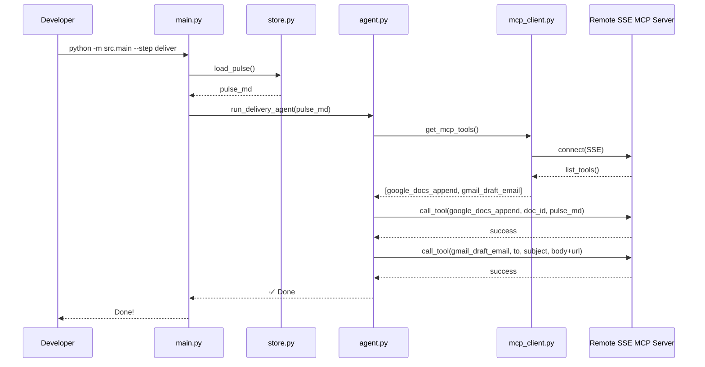
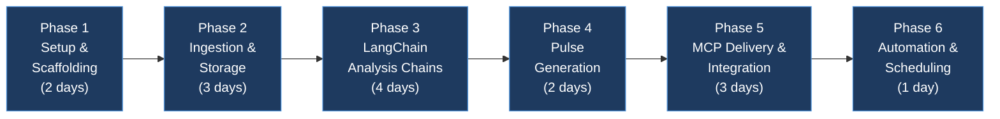

# Groww Review Agent — Phase-Wise Implementation Plan

## Overview

This document breaks the Groww Review Agent into **6 implementation phases**, each producing a working, testable increment. Every phase has clear goals, files to create/modify, acceptance criteria, and estimated effort.



---

## Phase 1 — Project Setup & Scaffolding

> **Goal:** Establish the project structure, install all dependencies, configure environment, and validate that LangChain + LLM (Gemini & Groq) connectivity works.

### Duration: ~2 days

### Tasks

| # | Task | Files | Details |
|---|---|---|---|
| 1.1 | Create directory structure | All directories under `src/`, `data/`, `config/`, `tests/`, `templates/` | Follow the layout from [architecture.md](file:///d:/Groww%20Review%20Agent/Docs/architecture.md) §6 |
| 1.2 | Initialize Python project | `requirements.txt`, `.env.example`, `.gitignore` | Pin all dependencies from architecture §13 |
| 1.3 | Create configuration loader | `src/config.py`, `config/config.yaml` | Load YAML config + `.env` environment variables using `pyyaml` + `python-dotenv` |
| 1.4 | Define Pydantic data models | `src/models.py` | `Review`, `ThemeAssignment`, `ClusteringResult`, `PulseNote`, `ActionIdea` |
| 1.5 | Validate LangChain + LLMs | `tests/test_llm_connection.py` | Simple "hello world" chains for both Gemini (`ChatGoogleGenerativeAI`) and Groq (`ChatGroq`) |
| 1.6 | Set up `main.py` entry point | `src/main.py` | CLI arg parser (`--step`, `--dry-run`), placeholder calls for each pipeline stage |
| 1.7 | Initialize Git repo | `.git`, `README.md` | Initial commit with project skeleton |

### Files Created

```
src/__init__.py
src/main.py
src/config.py
src/models.py
src/ingestion/__init__.py
src/storage/__init__.py
src/analysis/__init__.py
src/generation/__init__.py
src/delivery/__init__.py
config/config.yaml
.env.example
.gitignore
requirements.txt
README.md
tests/test_llm_connection.py
```

### Acceptance Criteria

- [ ] `pip install -r requirements.txt` succeeds without errors
- [ ] `python -m src.main --help` prints available CLI options
- [ ] `pytest tests/test_llm_connection.py` passes — confirms Gemini API key works and LangChain returns a response
- [ ] `config.yaml` loads correctly via `src/config.py`
- [ ] All Pydantic models in `src/models.py` can be instantiated with sample data

### Key Decisions

> [!IMPORTANT]
> **API Keys:** Must be set in `.env` as `GOOGLE_API_KEY` and `GROQ_API_KEY`. Verify with the team which keys to use.

---

## Phase 2 — Review Ingestion & Storage

> **Goal:** Fetch real Groww Play Store reviews, strip PII, normalize, deduplicate, and persist them locally in JSON format.

### Duration: ~3 days

### Dependencies: Phase 1 complete

### Tasks

| # | Task | Files | Details |
|---|---|---|---|
| 2.1 | Build Play Store scraper | `src/ingestion/scraper.py` | Use `google-play-scraper` to fetch reviews for `com.nextbillion.groww`. Parameters: `count=500+`, `sort=Sort.NEWEST`, last 8–12 weeks. Return list of raw review dicts. |
| 2.2 | Build PII stripper | `src/ingestion/preprocessor.py` | Regex-based PII detection and redaction (emails → `[email]`, phones → `[phone]`, usernames → `[user]`, device IDs → `[id]`). Must run **before** any persistence. |
| 2.3 | Build text normalizer | `src/ingestion/preprocessor.py` | Lowercase, strip excessive whitespace, handle unicode/emoji, truncate extremely long reviews. |
| 2.4 | Build deduplication logic | `src/ingestion/preprocessor.py` | Deduplicate by `review_id`. Skip reviews already present in the data store. |
| 2.5 | Build JSON data store | `src/storage/store.py` | `save_reviews(reviews)`, `load_reviews(date_range)`, `get_review_ids()`. Store as `data/reviews/YYYY-MM-DD.json` per batch. |
| 2.6 | Wire ingestion into `main.py` | `src/main.py` | `--step ingest` triggers: scrape → preprocess → store |
| 2.7 | Write unit tests | `tests/test_scraper.py`, `tests/test_preprocessor.py` | Test PII stripping with known inputs, test dedup logic, test scraper returns expected schema |

### Files Created/Modified

```
[NEW]  src/ingestion/scraper.py
[NEW]  src/ingestion/preprocessor.py
[NEW]  src/storage/store.py
[MOD]  src/main.py
[NEW]  tests/test_scraper.py
[NEW]  tests/test_preprocessor.py
[NEW]  data/reviews/           (created at runtime)
```

### Data Flow (Phase 2)


### Acceptance Criteria

- [ ] `python -m src.main --step ingest` fetches and stores reviews successfully
- [ ] Reviews stored in `data/reviews/YYYY-MM-DD.json` with correct schema matching `models.Review`
- [ ] PII stripping verified: no emails, phone numbers, or usernames in stored reviews
- [ ] Running ingestion twice does not create duplicate entries
- [ ] At least 200+ reviews fetched from Groww's Play Store listing
- [ ] All unit tests pass: `pytest tests/test_scraper.py tests/test_preprocessor.py`

> [!CAUTION]
> **PII is the #1 risk.** Every stored review must pass through the PII stripper. Add a post-save validation check that scans stored JSON for PII patterns and raises an alert if any slip through.

---

## Phase 3 — LangChain Analysis Chains

> **Goal:** Build the three core LangChain LCEL chains — theme clustering, quote selection, and action idea generation — with structured outputs via Pydantic. All prompts and batching are designed around the **real Phase 2 dataset** (1,712 cleaned reviews, avg 25 words/review, ~56K tokens, date range Jul 03 – Sep 02, 2026).

### Duration: ~4 days

### Dependencies: Phase 2 complete (1,712 real reviews stored in [`data/reviews/2026-09-03.json`](file:///d:/Groww%20Review%20Agent/data/reviews/2026-09-03.json))

### Real Data Profile

| Metric | Value |
|---|---|
| **Total reviews** | 1,712 |
| **Score distribution** | ★1: 668 (39.0%), ★2: 109 (6.4%), ★3: 130 (7.6%), ★4: 140 (8.2%), ★5: 665 (38.8%) |
| **Sentiment split** | Negative (★1–2): 777 (45.4%) · Neutral (★3): 130 (7.6%) · Positive (★4–5): 805 (47.0%) |
| **Date range** | Jul 03 – Sep 02, 2026 (~9 weeks, 62 unique dates) |
| **Avg words/review** | 25 (min: 8, max: 129, median: 17) |
| **Total tokens (est.)** | ~56,700 (exceeds single-pass — **batching required**) |
| **Top app versions** | 18.13.2 (338), 18.12.1 (245), 18.15.1 (183), 18.14.2 (149), 18.14.1 (149) |
| **Hinglish reviews** | ~74 (~4.3% of dataset) |

### Observed Theme Patterns in Real Data

From keyword analysis of the 1,712 reviews, these are the **recurring theme clusters** the LLM should discover:

| Theme (expected) | Approx. matches | Example signals |
|---|---|---|
| **User-Friendly / Positive Praise** | ~296 | "simple to use", "beginner friendly", "clean interface", "easy to understand" |
| **Customer Support Failures** | ~269 | "worst customer service", "no reply to email", "chat response delay", "no resolution even after 1 week" |
| **Feature Requests (Chart/Trading Tools)** | ~237 | "Volume Candles", "trailing stoploss", "trade directly from charts", "OI profile on chart" |
| **F&O / Options Trading Issues** | ~222 | "option chain lagging", "margin too high", "instant exit not working", "square-off timing issues" |
| **App Performance (Lag/Crash/Glitches)** | ~180 | "app keeps crashing", "data doesn't update", "option chain starts lagging", "app has become too slow" |
| **Mutual Fund / SIP Issues** | ~180 | "SIP returns negative", "MF cart payment issue", "no live NAV update", "international MF not searchable" |
| **Brokerage / Charges Too High** | ~162 | "brokerage charges very high", "competitors offer zero brokerage", "equity delivery charges too" |
| **Update Regression / UI Breakage** | ~149 | "recent update made it worse", "navigation button gone after update", "every week unnecessary update" |
| **Chart / Scalper Button Issues** | ~126 (+37 scalper-specific) | "scalper option is irritating", "back button disappears in chart", "full screen chart issues" |
| **KYC / Account Issues** | ~125 | "KYC pending for weeks", "unable to change email", "demat account closure no response" |
| **Payment / Transaction Issues** | ~109 | "payment failed but debited", "UPI mandate issues", "withdraw amount held without reason" |
| **IPO Related** | ~53 | "IPO mandate status not updating", "advance order for allotted IPO missing" |

> [!NOTE]
> The dataset contains **~74 Hinglish reviews** (~4.3%) — Hindi words in Latin script (e.g. "scalper button mobile ke back button me hi he"). The theme clustering prompt must instruct the LLM to understand Hinglish and cluster these alongside their English equivalents — do NOT ignore them as noise.

> [!WARNING]
> **The dataset is heavily polarized:** 39% are ★1 and 38.8% are ★5, with very few in between. The LLM must not over-index on either sentiment. The theme clustering prompt should instruct the model to identify themes across ALL star ratings — both pain points and praise — and rank by total volume, not just negative reviews.

### Tasks

| # | Task | Files | Details |
|---|---|---|---|
| 3.1 | Define analysis prompt templates | `src/analysis/prompts.py` | Three `ChatPromptTemplate` definitions: (a) theme clustering, (b) quote selection, (c) action ideas. Include format instructions from output parsers. Prompts must explicitly handle **Hinglish** content. |
| 3.2 | Configure output parsers | `src/analysis/parsers.py` | `PydanticOutputParser(pydantic_object=ClusteringResult)` for themes, `PydanticOutputParser` for actions, `StrOutputParser` for quotes. |
| 3.3 | Build theme clustering chain | `src/analysis/chains.py` | **Two-pass batching strategy** (see below). 1,712 reviews ≈ 56K tokens — too large for a single call under Groq's 8K TPM limit. Batch into groups of ~50 reviews → extract sub-themes per batch → merge in a final consolidation call. Output: `ClusteringResult` (≤ 5 themes with review IDs and counts). |
| 3.4 | Build quote selection chain | `src/analysis/chains.py` | `quote_chain = prompt | llm | parser`. Input: top 3 themes + their review texts. Output: 1 verbatim quote per theme (3 total). Must select **English-language** quotes only for the final pulse. |
| 3.5 | Build action idea chain | `src/analysis/chains.py` | `action_chain = prompt | llm | parser`. Input: top 3 themes + summary statistics (review count, score distribution, date range). Output: 3 concrete, Groww-specific action ideas. |
| 3.6 | Add retry logic | `src/analysis/chains.py` | `.with_retry(stop_after_attempt=3)` on each chain. Add `OutputFixingParser` as fallback for parsing failures. |
| 3.7 | Wire analysis into `main.py` | `src/main.py` | `--step analyze` triggers: load reviews → run theme_chain (batched) → run quote_chain → run action_chain → save results to `data/analysis/YYYY-MM-DD.json` |
| 3.8 | Write chain tests | `tests/test_chains.py` | Test with **real reviews from Phase 2** (integration) + mock LLM responses (unit). Verify Pydantic models parse correctly. Include a test with Hinglish input. Test batching logic with >200 reviews. |

### Batching Strategy



> [!TIP]
> **Why two-pass?** 1,712 reviews × 25 avg words ≈ 56K tokens. Groq's `openai/gpt-oss-120b` has a strict 8K Tokens Per Minute (TPM) limit. Batching into groups of ~50 (using short sequential IDs) ensures we stay well within the TPM limit per request, while the consolidation step deduplicates similar themes across batches.

### Files Created/Modified

```
[NEW]  src/analysis/prompts.py
[NEW]  src/analysis/parsers.py
[NEW]  src/analysis/chains.py
[MOD]  src/main.py
[NEW]  tests/test_chains.py
[NEW]  data/analysis/           (created at runtime)
```

### Chain Architecture (Phase 3)



### Prompt Design Guidelines

| Chain | System Prompt Key Points | Expected Output |
|---|---|---|
| **theme_chain** (per batch) | "You are a product analyst for Groww, an Indian stock trading & mutual fund app. Group these ~200 reviews into at most 8 sub-themes. Reviews may be in English or Hinglish (Hindi in Latin script) — understand both. Each theme needs a short label, the review IDs it contains, and a count." | `ClusteringResult` (Pydantic, ≤ 8 sub-themes) |
| **consolidation_chain** | "You have sub-themes from multiple batches of Groww app reviews. Merge overlapping sub-themes into at most 5 final themes. Combine review ID lists. Rank by total review count descending." | `ClusteringResult` (Pydantic, ≤ 5 final themes) |
| **quote_chain** | "From the reviews in each theme below, select the single most representative **English-language** verbatim quote. Do not modify the text. Prefer quotes that clearly articulate the user's pain point or praise with specific detail." | 3 plain-text quotes |
| **action_chain** | "Based on these Groww user feedback themes from 1,712 reviews over 9 weeks (Jul–Sep 2026), suggest 3 specific, actionable improvements the product team can implement. Reference Groww features by name (e.g., Scalper mode, TradingView chart, option chain, F&O Lock). Be concrete, not generic." | `ActionIdeas` (Pydantic) |

### Expected Output Example (based on real data)

```
Themes discovered (expected from 1,712 reviews):
1. "Customer Support & Response Failures" (~269 reviews)
   - No response to emails/calls, 15-20 min chat delays
   - Account/email change requests unresolved for weeks
2. "App Performance & Update Regression" (~329 reviews, merged)
   - Navigation button gone after update, scalper button interferes with back
   - Charts lagging, data not refreshing, option chain slow
3. "Brokerage Charges & Fee Complaints" (~162 reviews)
   - Equity delivery charges higher than competitors
   - Users switching to zero-brokerage alternatives
4. "F&O / Options Trading Pain Points" (~222 reviews)
   - Instant exit not working, margin requirements too high
   - Square-off timing discrepancies, slippage issues
5. "Positive: User-Friendly Interface" (~296 reviews)
   - Clean UI, beginner-friendly, simple navigation
   - Good for long-term investing and mutual funds

Sample verbatim quotes (from real reviews):
• "worst experience... trying to reach the customer care...
   no reply to email and didn't pick up the customer care call"
• "data doesn't update after latest update.
   i have to refresh every second to track prices"
• "brokerage charges very high other apps brokerage charges 0"

Sample action ideas:
1. Implement SLA-tracked customer support queue with estimated
   response time and ticket status visible in-app
2. Restore chart navigation button, add user-configurable scalper
   mode position, fix real-time price feed WebSocket
3. Introduce competitive brokerage tiers or loyalty discounts
   for high-volume equity delivery traders
```

### Acceptance Criteria

- [ ] `python -m src.main --step analyze` runs successfully on all 1,712 real reviews
- [ ] Batching correctly splits reviews into ~200-review groups and consolidates sub-themes
- [ ] Theme clustering produces ≤ 5 final themes, each with a clear label
- [ ] Top 3 themes are correctly ranked by volume (descending)
- [ ] Hinglish reviews (~74) are clustered alongside English reviews into correct themes (not dropped or mis-classified)
- [ ] 3 verbatim quotes returned — none invented, all traceable to real review IDs in the data store
- [ ] 3 action ideas returned — reference Groww-specific features (Scalper mode, option chain, F&O Lock, etc.)
- [ ] Pydantic parsing succeeds consistently (>90% of runs without `OutputFixingParser` fallback)
- [ ] Retry logic handles transient Groq API errors gracefully
- [ ] Analysis results saved to `data/analysis/YYYY-MM-DD.json`
- [ ] `pytest tests/test_chains.py` passes

> [!IMPORTANT]
> **Hinglish handling is critical.** ~74 reviews (4.3%) are Hinglish (e.g. "scalper button mobile ke back button me hi he"). The theme clustering prompt must explicitly instruct the LLM to understand Hindi written in Latin script and merge these with English reviews about the same topic. Test with known Hinglish reviews to verify.

> [!TIP]
> **Rate limits & execution time:** Groq `openai/gpt-oss-120b` has limits of 30 Requests Per Minute (RPM), 8K Tokens Per Minute (TPM), 1K Requests Per Day (RPD), and 200K Tokens Per Day (TPD). The batching strategy (50 reviews/batch with short IDs) + 10s inter-call sleep ensures we stay below the 8K TPM constraint.

---

## Phase 4 — Pulse Note Generation

> **Goal:** Assemble the analysis outputs (themes, quotes, actions) into a polished ≤ 250-word Weekly Pulse note in both Markdown and plain-text formats.

### Duration: ~2 days

### Dependencies: Phase 3 complete

### Tasks

| # | Task | Files | Details |
|---|---|---|---|
| 4.1 | Create pulse template | `templates/pulse_template.md` | Markdown template with placeholders for date, themes (with counts), quotes (with ratings), and action ideas |
| 4.2 | Build pulse builder chain | `src/generation/pulse_builder.py` | LangChain chain that takes structured analysis output and produces the final pulse note. Enforce ≤ 250 words via prompt instruction. Output both Markdown and plain-text variants. Use Gemini model `gemini-3.6-flash` for this phase. |
| 4.3 | Add word count validation | `src/generation/pulse_builder.py` | Post-generation check: if pulse > 250 words, re-prompt LLM to condense. Log warning if still over limit. |
| 4.4 | Add pulse archiving | `src/storage/store.py` | `save_pulse(pulse, date)` → writes to `data/pulses/YYYY-MM-DD.md`. Keep history of all generated pulses. |
| 4.5 | Wire generation into `main.py` | `src/main.py` | Full pipeline now works: ingest → analyze → generate. `--dry-run` prints pulse to console without delivery. |
| 4.6 | Write tests | `tests/test_pulse_builder.py` | Test template rendering with mock analysis data. Verify word count constraint. Verify both Markdown and plain-text outputs. |

### Files Created/Modified

```
[NEW]  templates/pulse_template.md
[NEW]  src/generation/pulse_builder.py
[MOD]  src/storage/store.py
[MOD]  src/main.py
[NEW]  tests/test_pulse_builder.py
[NEW]  data/pulses/             (created at runtime)
```

### Pulse Output Example

```
📊 Groww Weekly Review Pulse — Week of Sep 01, 2026

🔍 TOP THEMES
1. KYC Verification Issues (87 mentions)
2. Payment Failures (64 mentions)
3. App Crashes & Performance (51 mentions)

💬 WHAT USERS ARE SAYING
• "KYC has been pending for 3 weeks, no response from support" — ★1
• "Payment failed twice but amount was debited, still waiting for refund" — ★2
• "App freezes every time I try to check my portfolio" — ★1

🎯 ACTION IDEAS
1. Add KYC status tracking with estimated resolution time in the app
2. Implement automatic refund triggers for failed payment transactions
3. Profile and optimize portfolio loading — target <2s cold start

📅 Reviews analyzed: 412 | Period: Jun 23 – Sep 01, 2026
```

### Acceptance Criteria

- [ ] `python -m src.main --dry-run` prints a complete pulse to console
- [ ] Pulse contains exactly 3 themes, 3 quotes, 3 action ideas
- [ ] Pulse is ≤ 250 words
- [ ] Quotes are verbatim (match stored reviews exactly)
- [ ] Both Markdown and plain-text variants are generated
- [ ] Pulse is archived to `data/pulses/YYYY-MM-DD.md`
- [ ] `pytest tests/test_pulse_builder.py` passes

---

## Phase 5 — MCP Delivery & End-to-End Integration

> **Goal:** Publish the pulse to Google Docs and create a Gmail draft via a remote MCP server using SSE. Wire the complete end-to-end pipeline.

### Duration: ~3 days

### Dependencies: Phase 4 complete + MCP server deployed

### Tasks

| # | Task | Files | Details |
|---|---|---|---|
| 5.1 | Configure MCP server | `config/config.yaml` | Add the remote SSE URL for the deployed Railway MCP server and a target Google Doc ID. |
| 5.2 | Build MCP Client | `src/delivery/mcp_client.py` | Connect to the remote SSE server using `mcp.client.sse.sse_client`. Dynamically convert exposed MCP tools into LangChain `StructuredTool` objects. |
| 5.3 | Build Delivery Agent | `src/agent.py` | Create a LangChain agent using the fetched MCP tools (`google_docs_append`, `gmail_draft_email`). Agent reads the pulse, appends it to Docs, and creates a Gmail draft with a link to the Doc. |
| 5.4 | Wire full pipeline in `main.py` | `src/main.py` | Add `--step deliver` command. Wrap agent invocation with `asyncio.run` since the MCP client is async. |
| 5.5 | End-to-end smoke test | Manual | Run full pipeline against real reviews → verify Google Doc updated → verify Gmail draft exists |

### Files Created/Modified

```
[MOD]  config/config.yaml
[NEW]  src/delivery/mcp_client.py
[NEW]  src/agent.py
[MOD]  src/main.py
```

### End-to-End Flow (Phase 5)



### Acceptance Criteria

- [ ] `python -m src.main --step deliver` connects to the remote MCP server using SSE.
- [ ] The agent appends the pulse to the configured Google Doc.
- [ ] The agent creates a Gmail draft containing the pulse and a link to the Google Doc.
- [ ] MCP failures are handled gracefully — error is logged.

> [!WARNING]
> **MCP Server Setup Required:** Before starting Phase 5, ensure:
> 1. The remote MCP Server at `https://mcp-server-production-acc6.up.railway.app` is reachable.
> 2. The Google Doc ID is configured in `config.yaml`.
> 3. The target email address is set in `config/config.yaml`.

---

## Phase 6 — Automation & Scheduling

> **Goal:** Run the full agent pipeline on a weekly schedule using GitHub Actions. The scheduler will automatically ingest reviews, analyze them, generate the pulse, and deliver it via MCP.

### Duration: ~1 day

### Dependencies: Phase 5 complete, Repository pushed to GitHub

### Tasks

| # | Task | Files | Details |
|---|---|---|---|
| 6.1 | Create GitHub Workflow | `.github/workflows/scheduler.yml` | Set up a `schedule` trigger (e.g., `cron: '0 9 * * 1'` for every Monday at 9 AM). Add a `workflow_dispatch` trigger for manual runs. |
| 6.2 | Define CI/CD Steps | `.github/workflows/scheduler.yml` | Checkout code, setup Python, install dependencies, run pipeline. |
| 6.3 | Configure Secrets | GitHub Repository Settings | Map `GOOGLE_API_KEY`, `GROQ_API_KEY` to GitHub Action Secrets. Provide necessary config overrides. |

### Files Created/Modified

```
[NEW]  .github/workflows/scheduler.yml
```

### Acceptance Criteria

- [ ] GitHub Action `.github/workflows/scheduler.yml` is present in the repository.
- [ ] Workflow contains a `schedule` cron trigger for weekly execution.
- [ ] Workflow correctly installs dependencies and runs the agent.
- [ ] Required secrets and environment variables are documented.

---

## Phase Summary



| Phase | Duration | Key Deliverable | Runnable Command |
|---|---|---|---|
| **Phase 1** | ~2 days | Project skeleton + LLM connectivity | `pytest tests/test_llm_connection.py` |
| **Phase 2** | ~3 days | Reviews ingested and stored | `python -m src.main --step ingest` |
| **Phase 3** | ~4 days | Themes, quotes, actions from real reviews | `python -m src.main --step analyze` |
| **Phase 4** | ~2 days | Polished pulse note (≤ 250 words) | `python -m src.main --dry-run` |
| **Phase 5** | ~3 days | Full pipeline with Docs + Gmail delivery | `python -m src.main --step deliver` |
| **Phase 6** | ~1 day | Automated weekly schedule via GitHub Actions | N/A |
| **Total** | **~15 days** | | |

---

## Risk Register

| Risk | Impact | Likelihood | Mitigation |
|---|---|---|---|
| Groq API rate limits during batch clustering | High | Medium | Chunk reviews into batches of 50, use short IDs. Add 10s sleep between calls to respect 8K TPM. |
| `google-play-scraper` breaks due to Play Store changes | High | Low | Pin version. Add fallback to manual CSV import. Monitor for library updates. |
| LLM produces inconsistent theme labels across runs | Medium | High | Seed with predefined theme categories in prompt. Use low temperature (0.3). |
| MCP server authentication issues | High | Medium | Test OAuth flow early in Phase 5. Document manual credential setup steps. |
| PII leaks into generated pulse | Critical | Low | Double-strip: at ingestion AND at generation. Add automated PII scan in tests. |
| Pulse exceeds 250-word limit | Low | Medium | Post-generation word count check. Re-prompt if over. Hard-truncate as last resort. |

---

## Definition of Done (Project-Level)

The project is **complete** when ALL of the following are true:

- [ ] Running `python -m src.main` successfully executes the full pipeline
- [ ] A Google Doc is created with the Weekly Pulse containing top 3 themes, 3 verbatim quotes, and 3 action ideas
- [ ] A Gmail draft is created linking to the Google Doc
- [ ] The pulse is ≤ 250 words
- [ ] No PII is present in any artifact (stored reviews, pulse, Doc, email)
- [ ] All tests pass: `pytest tests/`
- [ ] The project is documented with README.md setup instructions
- [ ] Code is committed to Git with clean history
- [ ] GitHub Action scheduler is configured to run weekly
